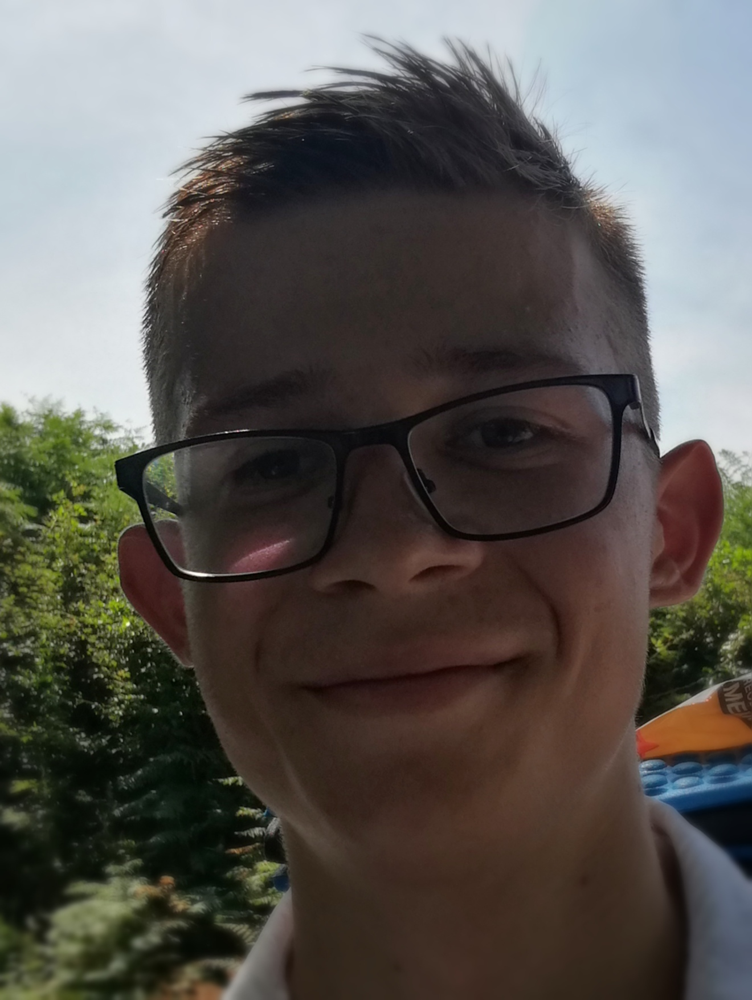

# My resume

Full Name: **_Raman Sakalou_**

**Date of birth**: 02.10.1998

**Occupation**: Translator-assistant, Junior JavaScript developer

- **Citizenship**: Republic of Belarus, Minsk city

- **Work Experince**: since 2016 I have been working as translator. I performed verbal and verbal translations at meetings, conerences and exhibitions for Bureaus of translations as well as for private entities.

- **Education**: I am getting a degree in translation at Minsk State Linguistic University and also interested in software development.

At this point my English level is _C1_.

- **Personality**: I am a hardworing and purposful individual with good soft-skills ready to learn new thing and work as much as it takes to achive the goal. My biggest strengths are perseverance and openmindedness.

**Contact info** :

e-mail: haloroma1998@gmail.com

phone: `+375292572035` (Telegram, Whatsapp, Skype, Viber)

[My GitHub](https://github.com/RamanSakalou)
